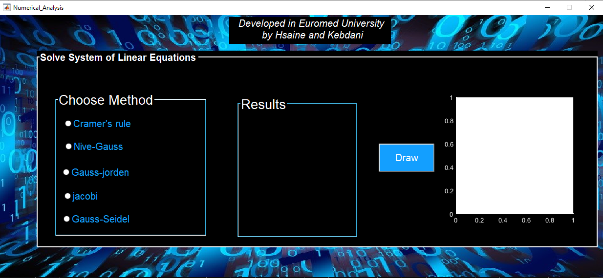

<h1 align="center"> Interface_graphique_Matlab</h1>

<h1 align="center"> Résolution d’un système linéaire Ax=b</h1>
 
  Résolution d’un système linéaire Ax=b
 

<h1 align="center"> Remerciement</h1>
On remercie dieu le tout puissant de nous avoir donné la santé et la Volonté
d’entamer et de terminer ce projet.
Je tiens à remercier dans un premier temps, toute l’équipe pédagogique de l'école
d’ingénierie digitale et d’intelligence artificielle.
Avant, d’entamer ce rapport nous profitons de l’occasion pour remercier tout
d’abord notre professeur Dr. Meryem ELMOUHTADI qui n’a pas cessé de nous
encourager pendant la durée du projet, ainsi pour sa générosité en matière de
formation et d’encadrement, pour la qualité de son encadrement exceptionnel,
pour sa patience, sa rigueur et sa disponibilité durant notre préparation de ce
projet. Nous le remercions également pour l’aide et les conseils concernant les
missions évoquées dans ce rapport, qu’il nous a apporté lors des différents suivis,
et la confiance qu’il nous a témoigné.
 
<h1 align="center"> Introduction</h1>
Les interfaces graphiques (ou interfaces homme-machine) sont appelées
GUI (pour Graphical User Interface) sous MATLAB. Elles permettent à
l'utilisateur d'interagir avec un programme informatique, grâce à différents objets
graphiques (boutons, menus, cases à cocher…). Ces objets sont généralement
actionnés à l'aide de la souris ou du clavier.

Dans le cadre de la deuxième année de cycle préparatoire nous avons réalisé une interface graphique permettant à
l’utilisateur de résoudre un système linéaire Ax=b.
Grâce à ce projet nous avons eu l’opportunité de cumuler les connaissances
théoriques (Cours Analyse numérique) avec celle de la pratique (Matlab), ceci
permet également de rentrer dans la vie active et découvrir plus précisément le
milieu professionnel.
Ce projet consiste à découvrir le ‘GUIDE’ de logiciel Matlab, celui-là
facilite la tâche de calcul d’un système linéaire, ce calcul peut se faire en différents
méthodes selon le choix de l’utilisateur mais tous les méthodes ramène au même
résultat, la seule différence entre ces méthodes est le cout d’exécution, cette
interface affiche le résultat numériquement puis graphiquement en appuyions sur
le buton DRAW.
<h1 align="center"> Description du projet</h1>
Le projet consiste à créer une interface graphique permet aux utilasateurs le resolution d'un systeme Ax=b
<h1 align="center"> Rapport</h1>
Pour plus de details télecharger le rapport ci-dessous:
<https://www.markdownguide.org>
